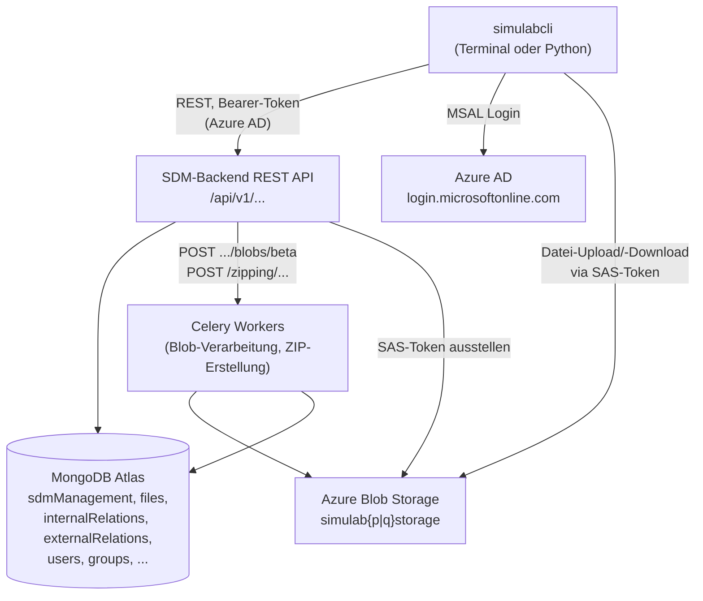

# SDM-Backend REST API – Reverse-Engineered Referenz

> **Titel (laut OpenAPI):** SDM-Backend API
> **Beschreibung:** "REST API for the simuLAB NG."
> **Version:** `v1.10.0-2026-08-20-10:21`
> **Kontakt:** Monika Piestrzyńska ([monika.piestrzynska@bosch.com](mailto:monika.piestrzynska@bosch.com))
> **Basis-URLs** (aus `simulabcli._instance.API_URLS`, jeweils bereits inkl. `/api/v1/`):
> - PROD: `https://simulab.bosch.tech/api/v1/`
> - QA: `https://simulab-q.bosch.tech/api/v1/`
> **Blob-Storage-URLs** (aus `simulabcli._instance.BLOB_STORAGE_URLS`):
> - PROD: `https://simulabpstorage.blob.core.windows.net/`
> - QA: `https://simulabqstorage.blob.core.windows.net/`

## Methodik & Grenzen dieser Doku

Diese Datei wurde **nicht** offiziell von Bosch bereitgestellt, sondern durch Reverse Engineering erstellt aus:

1. dem rohen OpenAPI-3.1-Export des Servers (Stand `2026-08-20`),
2. dem Quellcode des Python-Pakets `simulabcli` (`cli.py`, `_utils.py`, `_item_schema.py`, `_instance.py`),
3. der generierten CLI-Referenz [SimulabCli API reference](https://pages.github.boschdevcloud.com/simuLAB/simulabCLI/latest/INSTALLATION/),
4. dem MongoDB-Datenmodell [MongoDB data models.md](https://inside-docupedia.bosch.com/confluence/spaces/simuLAB/pages/5288400828/08.01+-+MongoDB+data+models).

Wo der Endpunkt eindeutig aus dem OpenAPI-Schema hervorgeht, ist das als Fakt dargestellt. Wo ich Verhalten aus dem Python-Client-Code abgeleitet habe (z. B. welche Reihenfolge von Aufrufen ein CLI-Befehl auslöst), ist das gekennzeichnet. Abschnitt ["Offene Punkte"](#offene-punkte--nicht-abschließend-rekonstruierbar) listet Dinge, die sich aus den verfügbaren Quellen **nicht** zweifelsfrei klären ließen.

---

## Authentifizierung

Security Scheme: **`OAuth2AuthorizationCodeBearer`** (OAuth2 Authorization-Code-Flow gegen Azure AD, kein eigener Login-Endpunkt am Backend):

| Parameter | Wert |
|---|---|
| `authorizationUrl` | `https://login.microsoftonline.com/0ae51e19-07c8-4e4b-bb6d-648ee58410f4/oauth2/v2.0/authorize` |
| `tokenUrl` | `https://login.microsoftonline.com/0ae51e19-07c8-4e4b-bb6d-648ee58410f4/oauth2/v2.0/token` |
| Scope | `api://c0522f4b-afe0-4f58-89bc-a1453a166756/user_access` |

Das Backend validiert also direkt das von Azure AD ausgestellte Bearer-Token (kein eigenes JWT-Issuing). Das passt zur `_token.py`-Implementierung der CLI (MSAL Public-Client, `redirect_uri="http://localhost"`, interaktiver Login im Browser) und zur bekannten Notwendigkeit, den Bosch-Corporate-Proxy für den Zugriff auf `login.microsoftonline.com` zu berücksichtigen (`BoschProxy`-Context-Manager).

Jeder Endpunkt außer `get_selectable_values_for_sdm_metadata`, `get_predefined_values_for_relations` … moment, tatsächlich verlangt laut Spec **jeder einzelne Endpunkt** (auch die beiden gerade genannten) `security: [{OAuth2AuthorizationCodeBearer: []}]` – es gibt keinen unauthentifizierten Endpunkt.

### `GET /api/v1/auth/refresh-token`
**Tag:** Authentication
**Zweck laut Summary:** "Get New Access Token". **Widerspruch im Docstring:** Die Backend-Beschreibung selbst sagt *"Endpoint to revoke the access token."* – das ist vermutlich ein Copy-&-Paste-Fehler im Server-Quelltext, da Response-Modell (`AccessTokenResponse`) und Summary klar für "neues Token ausstellen" sprechen.
**Response:** `200` → [`AccessTokenResponse`](#accesstokenresponse)
**Genutzt von simulabcli:** nicht im gelesenen Code gefunden (Token-Handling läuft primär über MSAL/`_token.py` direkt gegen Azure AD).

### `GET /api/v1/auth/licensed-users`
**Tag:** Access Rights (nicht "Authentication" – vermutlich weil er nur für den "Nutzer teilen"-Dialog der Access-Rights-Funktion gebraucht wird)
**Zweck:** Sucht lizenzierte simuLAB-Nutzer, deren `ntId` oder `fullName` einen Substring enthält.

| Parameter | In | Pflicht | Typ | Hinweis |
|---|---|---|---|---|
| `name-contains` | query | ✅ | string, `minLength: 3` | mind. 3 Zeichen |

**Response:** `200` → [`LicensedUsersResponse`](#licensedusersresponse), `422` → `HTTPValidationError`
**Genutzt von simulabcli:** nicht gefunden (vermutlich nur Web-UI, z. B. Access-Rights-Sharing-Dialog).

---

## Metadata (Kern-Domäne: simulierte Items / SDM-Items)

### `POST /api/v1/sdm-management-data`
**Zweck:** Legt ein neues SDM-Item (Version 1, Revision `001`) an.

| Parameter | In | Pflicht | Typ | Default |
|---|---|---|---|---|
| `will-upload-files` | query | ❌ | boolean | `false` |

`will-upload-files=true` sorgt dafür, dass sofort eine Sperre (**Lock**) gesetzt wird, damit zwischen Metadaten-Erzeugung und Datei-Upload niemand anders eingreifen kann.
**Request Body:** [`SdmManagementInputParams`](#sdmmanagementinputparams)
**Response:** `201` → [`SdmManagementResponse`](#sdmmanagementresponse), `422`
**Genutzt von:** `_utils.send_meta_data_to_mongo_db()` → CLI-Funktionen `upload_list()` / `upload_directory()` (nur bei neuem Item).

### `GET /api/v1/sdm-management-data/{sdm_number_revision}`
**Zweck:** Metadaten eines Items für die Detailseite (neueste Version, sofern `version` nicht angegeben).

| Parameter | In | Pflicht | Typ |
|---|---|---|---|
| `sdm_number_revision` | path | ✅ | string, Pattern `(?i)^sdm\d{7}-\d{3}$` |
| `version` | query | ❌ | integer ≥ 1 oder `null` |

**Response:** `200` → [`ItemDetailedPageMetadataResponse`](#itemdetailedpagemetadataresponse), `422`
**Genutzt von:** `_utils.get_meta_data_from_mongo_db()` → CLI `get_metadata()`, sowie intern in `sdm_number2box_id()`, `write_item_metadata_json()` (für `download()`), `create_container()` (Verifikation), `upload_list_to_existing_item()` (existierende Metadaten holen).

### `PUT /api/v1/sdm-management-data/{sdm_number_revision}` ⚠️ *deprecated*
**Zweck:** Erstellt eine neue Metadaten-**Version** über SDM-Nummer+Revision adressiert (statt über `simulationBoxId`). Kopiert Relations (bei denen das Item Quelle ist) und optional Dateien in die neue Version.

| Parameter | In | Pflicht | Typ | Default |
|---|---|---|---|---|
| `sdm_number_revision` | path | ✅ | string, Pattern `^[sS][dD][mM]\d{7}-\d{3}$` | – |
| `copy-files` | query | ❌ | boolean | `false` (auf `true` setzen, wenn **nur** Metadaten geändert werden, keine Dateien) |

**Request Body:** [`SdmManagementBaseInputParams`](#sdmmanagementbaseinputparams) – **kein** `changeDescription` möglich/unterstützt.
**Response:** `201` → [`SdmManagementResponse`](#sdmmanagementresponse), `422`
**Genutzt von:** `_utils.update_metadata_in_mongo_db_by_sdm_number_revision()` → wird von `upload_list_to_existing_item()` **nur** angesteuert, wenn **kein** `changeDescription` mitgegeben wurde (der Client entfernt das Feld explizit aus dem Body, Kommentar im Code: *"change description is not supported in this version of endpoint"*). Da `changeDescription` clientseitig zunehmend verpflichtend wird (`FutureWarning`), wird dieser deprecated Pfad aus der CLI heraus perspektivisch nicht mehr erreichbar sein.

### `PUT /api/v1/sdm-management-data/simulation-boxes/{simulation_box_id}`
**Zweck:** Der **empfohlene** Nachfolger des obigen Endpunkts – adressiert über die Dokument-ID (`simulationBoxId`) statt SDM-Nummer/Revision, unterstützt `changeDescription`.

| Parameter | In | Pflicht | Typ | Default |
|---|---|---|---|---|
| `simulation_box_id` | path | ✅ | string (24-stellige ObjectId, hier **ohne** Regex-Pattern validiert) | – |
| `copy-files` | query | ❌ | boolean | `false` |

**Request Body:** [`SdmManagementUpdateParams`](#sdmmanagementupdateparams)
**Response:** `201` → [`SdmManagementResponse`](#sdmmanagementresponse), `422`
**Genutzt von:** `_utils.update_metadata_in_mongo_db_by_box_id()` → `upload_list_to_existing_item()`, wenn ein `changeDescription` angegeben wurde (Standard-/empfohlener Pfad, u. a. auch der Weg, um `status` zu ändern – siehe vorherige Konversation).

### `GET /api/v1/landing-page-metadata`
**Zweck:** Paginierte Liste aller (für den Nutzer sichtbaren) Items für die Startseite.

| Parameter | In | Pflicht | Typ | Default |
|---|---|---|---|---|
| `show_my_items_only` | query | ❌ | boolean | `false` |
| `page` | query | ❌ | integer ≥ 1 | `1` |
| `page_size` | query | ❌ | integer 1–200 | `10` |
| `sort_order` | query | ❌ | `"asc"` \| `"desc"` \| `null` | `"asc"` |
| `sort_by` | query | ❌ | [`OrderBy`](#orderby-enum) \| `null` | – |

**Response:** `200` → [`LandingPageMetadataCollection`](#landingpagemetadatacollection), `422`
**Genutzt von:** nicht in simulabcli gefunden (reine Web-UI-Funktionalität).

### `GET /api/v1/sdm-numbers`
**Zweck:** Autocomplete – findet vollständige SDM-Nummern zu einem Präfix.

| Parameter | In | Pflicht | Typ |
|---|---|---|---|
| `sdm-number-starts-with` | query | ✅ | string, Pattern `(?i)^sdm\d{1,6}$` |

**Response:** `200` → [`SdmPartiallyMatchedNumbers`](#sdmpartiallymatchednumbers), `422`
**Genutzt von:** nicht in simulabcli gefunden (Web-UI-Autocomplete).

### `GET /api/v1/sdm-management-data/{sdm_number}/revisions`
**Zweck:** Alle Revisionen + deren Versionen/ObjectIds zu einer SDM-Nummer.

| Parameter | In | Pflicht | Typ |
|---|---|---|---|
| `sdm_number` | path | ✅ | string, Pattern `(?i)^sdm\d{7}$` |

**Response:** `200` → [`RevisionsDataResponse`](#revisionsdataresponse), `422`
**Genutzt von:** `cli.get_revisions()` (direkter `_requests.get`-Aufruf).

### `GET /api/v1/sdm-management-data/{sdm_number_revision}/versions`
**Zweck:** Alle Versionen (Basis-Metadaten je Version) einer bestimmten Revision.

| Parameter | In | Pflicht | Typ |
|---|---|---|---|
| `sdm_number_revision` | path | ✅ | string, Pattern `(?i)^sdm\d{7}-\d{3}$` |

**Response:** `200` → [`SdmItemVersionsResponse`](#sdmitemversionsresponse), `422`
**Genutzt von:** `cli.get_versions()` (direkter `_requests.get`-Aufruf).

### `GET /api/v1/sdm-management-data/simulation-boxes/{simulation_box_id}/is-latest`
**Zweck:** Prüft, ob eine bestimmte Version (`simulationBoxId`) noch die neueste ist.
**Response:** `200` → [`IsLatestResponse`](#islatestresponse), `422`
**Genutzt von:** `_utils.check_latest_version()` → `LockContextManager.__enter__` (bricht mit `RuntimeError` ab, falls nicht mehr aktuell) und `cli.create_revision()`.

### `POST /api/v1/sdm-management-data/simulation-boxes/{simulation_box_id}/revisions`
**Zweck:** Erstellt eine **neue, leere Revision** (ohne Dateien/Relations der Ursprungsrevision zu kopieren); erzeugt aber eine interne Relation vom Typ `revisionConnectionType` (`"createdFrom"`, siehe MongoDB-Doku) zur Ursprungsrevision.

| Parameter | In | Pflicht | Typ | Default |
|---|---|---|---|---|
| `simulation_box_id` | path | ✅ | string | – |
| `copy-user-access` | query | ❌ | boolean | `false` |

**Request Body:** [`RevisionInputParams`](#revisioninputparams) (`changeDescription`, 1–100 Zeichen, Pflicht)
**Response:** `201` → [`SdmManagementResponse`](#sdmmanagementresponse), `422`
**Fehlerfälle laut Docstring:** `404` (Simulation Box nicht gefunden), `409` (durch anderen Nutzer gesperrt) – diese sind allerdings **nicht** im `responses`-Objekt der Spec modelliert, nur in der Freitext-Beschreibung erwähnt.
**Genutzt von:** `_utils.create_new_revision()` → `cli.create_revision()`.

### `GET /api/v1/sdm-management-data/sdm-numbers/{sdm_number}/revisions/history`
**Zweck:** Komplette Revisionshistorie (alle Revisionen mit ihrer jeweils neuesten Version + `createdFrom`-Verweis) – reichhaltiger als `.../revisions`.
**Response:** `200` → [`RevisionsHistoryResponse`](#revisionshistoryresponse), `422`
**Genutzt von:** nicht in simulabcli gefunden (vermutlich Web-UI "Revisionsverlauf").

---

## Selectable metadata values

### `GET /api/v1/sdm-management-data/metadata/selectable-values`
**Zweck:** Liefert alle gültigen Auswahlwerte für Metadatenfelder (aus den MongoDB-Collections `defaultMetadataValues`, `predefinedMetadataValues`, `groups`).
**Response:** `200` → [`SelectableMetadataResponse`](#selectablemetadataresponse) (kein `422`, da keine Parameter)
**Genutzt von:** `_item_schema.get_selectable_values()` (`@cache`) – wird bei **jeder** Validierung eines `SdmManagement*Params`-Objekts aufgerufen (Statusfeld, `product`, `productType`, `simulationDomain`, `simulationTool`, `groupId` …).
**Hinweis:** Laut MongoDB-Doku sind die aktuell gepflegten Status-Werte `"In Work"` und `"Release"` (nicht `"Released"`!) – die Liste ist aber zur Laufzeit ausschließlich über diesen Endpunkt autoritativ.

### `GET /api/v1/sdm-management-data/relations/predefined-values`
**Zweck:** Gültige Werte für Relations (`connectionType`, `sourceSystem`).
**Response:** `200` → [`PredefinedValuesRelations`](#predefinedvaluesrelations)
**Genutzt von:** `_utils.get_predefined_values()` → `validate_connection_type()` / `_validate_external_system()`, aufgerufen in `cli.create_relation()`.

---

## Access Rights

### `GET /api/v1/sdm-management-data/simulation-boxes/{simulation_box_id}/access-rights`
**Zweck:** Zugriffsrechte (lesend/schreibend, mit aufgelösten Namen) für eine Item-Version + Flag, ob der aktuelle Nutzer weitere Rechte vergeben darf (`requesterCanShare`).
**Response:** `200` → [`AccessRightsDataResponse`](#accessrightsdataresponse), `422`
**Genutzt von:** nicht in simulabcli gefunden (Web-UI "Freigeben"-Dialog).

### `PUT /api/v1/sdm-management-data/simulation-boxes/{simulation_box_id}/access-rights`
**Zweck:** Setzt Nutzer-Zugriffsrechte (read/write per NTID-Liste).
**Request Body:** [`UserAccessRequest`](#useraccessrequest)
**Response:** `201` → [`UserAccessResponse`](#useraccessresponse) (inkl. Diff: gewährt/entzogen/geändert), `422`
**Genutzt von:** nicht in simulabcli gefunden.
**Hinweis/Lücke:** Das MongoDB-Schema kennt zusätzlich `accessRights.groupAccess` (`admin`/`read`/`write` je Gruppe) – dafür gibt es **keinen** dokumentierten REST-Endpunkt; Gruppenrechte scheinen nicht über diese API steuerbar zu sein.

---

## Relations

### `POST /api/v1/relations-data/internal`
*(`operationId: create_internal_relation_unique`)*
**Zweck:** Erstellt eine interne Relation zwischen zwei Items/Dateien.
**Request Body:** [`InternalRelationInput`](#internalrelationinput) (`relation`: Array mit **genau 2** Einträgen [Quelle, Ziel] + `connectionType`)
**Response:** `201` → [`InternalRelationResponse`](#internalrelationresponse), `422`
**Genutzt von:** `_utils.create_internal_relation()` → `cli.create_relation(internal=True)`.

### `POST /api/v1/relations-data/external`
*(`operationId: create_external_relation_unique`)*
**Zweck:** Erstellt eine Relation zu einem externen System (z. B. Teamcenter).
**Request Body:** [`ExternalRelationInput`](#externalrelationinput)
**Response:** `201` → [`ExternalRelationResponse`](#externalrelationresponse), `422`
**Genutzt von:** `_utils.create_external_relation()` → `cli.create_relation(internal=False)`.

### `GET /api/v1/sdm-management-data/relations/simulation-boxes/{simulation_box_id}`
**Zweck:** Alle internen + externen Relationen eines Items.

| Parameter | In | Pflicht | Typ |
|---|---|---|---|
| `simulation_box_id` | path | ✅ | string, Pattern `^[a-f0-9]{24}$` |

**Response:** `200` → [`AllRelationsResponse`](#allrelationsresponse), `422`
**Genutzt von:** `_utils.get_relations_from_mongo_db()` → `cli.get_relations()`.

### `POST /api/v1/sdm-management-data/relations/external/from-files/simulation-boxes/{simulation_box_id}`
**Zweck:** Bulk-Erstellung externer Relationen direkt aus hochgeladenen `.psup`-Dateien.
**Response:** `201` → [`PsupExternalRelationResponse`](#psupexternalrelationresponse) (Statistik: Gesamt-, korrekte, eindeutige, erstellte, übersprungene, fehlgeschlagene Relationen + Liste fehlgeschlagener Dateinamen), `422`
**Genutzt von:** nicht in simulabcli gefunden.

### `PATCH /api/v1/sdm-management-data/simulation-boxes/{simulation_box_id}/relations/internal/{relation_box_id}`
### `PATCH /api/v1/sdm-management-data/simulation-boxes/{simulation_box_id}/relations/external/{relation_box_id}`
**Zweck (beide identisch, nur intern/extern getrennt):** Markiert eine Relation als **veraltet** (`deprecated`) oder hebt das wieder auf.
**Request Body:** [`DeprecationStatus`](#deprecationstatus) (`{"deprecated": true|false}`)
**Response:** `200` → [`RelationDeprecationResponse`](#relationdeprecationresponse) (bei `true`: `byUser`+`onDate` gesetzt, bei `false`: `null`), `422`
**Fehlerfälle laut Docstring:** `404` (Relation nicht gefunden), `409` (Business-Regel verletzt), `500` – nicht im `responses`-Objekt modelliert.
**Genutzt von:** nicht in simulabcli gefunden (kein `deprecate_relation`-Äquivalent in der öffentlichen CLI-API).

---

## Files (Blob-Metadaten in MongoDB)

> Wichtig für das Architekturverständnis: Die eigentlichen **Dateiinhalte** laufen **nicht** über diese REST-API. Sie werden über ein SAS-Token direkt gegen **Azure Blob Storage** hoch-/heruntergeladen (`azure.storage.blob.BlobServiceClient` im CLI-Code). Diese REST-API verwaltet nur die **Metadaten** der Dateien (Name, Größe, MD5, Tag) in MongoDB.

### `POST /api/v1/sdm-management-data/simulation-boxes/{simulation_box_id}/blobs`
**Zweck:** Liest die Blobs eines Containers aus Azure Blob Storage aus und schreibt ihre Metadaten synchron in die Datenbank.

| Parameter | In | Pflicht | Typ |
|---|---|---|---|
| `simulation_box_id` | path | ✅ | string, Pattern `^[a-f0-9]{24}$` |

**Request Body:** [`BlobsContainerDataInputModel`](#blobscontainerdatainputmodel) (`filesToExclude`, max. 100 Einträge)
**Response:** `201` → [`BlobsDataResponseModel`](#blobsdataresponsemodel), `422`
**Genutzt von:** `_utils.add_blob_data_to_mongodb()` → nach jedem Datei-Upload in `upload_list()` / `upload_list_to_existing_item()`.

### `GET /api/v1/sdm-management-data/simulation-boxes/{simulation_box_id}/blobs`
**Zweck:** Liest die in MongoDB gespeicherten Blob-Metadaten (Größe, MD5, Version-ID) aus.
**Response:** `200` → [`BlobSizeResponseModel`](#blobsizeresponsemodel), `422`
**Genutzt von:** `_utils.get_file_info_for_item()` → `cli.list_files()`, sowie intern zum Datei-Diff in `upload_list_to_existing_item()`.

### `POST /api/v1/sdm-management-data/simulation-boxes/{simulation_box_id}/blobs/beta`
**Zweck:** Asynchrone Variante von oben – stößt einen **Celery-Task** an statt synchron zu blockieren.
**Response:** `202` → [`CeleryTaskResponse`](#celerytaskresponse) (`taskId`), `422`
**Genutzt von:** nicht in simulabcli 1.2.0 verwendet (Beta/zukünftig, oder nur Web-UI für sehr große Uploads).

### `GET /api/v1/sdm-management-data/blobs/status/{task_id}`
**Zweck:** Streamt den Status des obigen Celery-Tasks per **Server-Sent Events** bis `SUCCESS`/`FAILURE`.
**Response:** `200` (`text/event-stream`), `401` (nicht authentifiziert), `409` (Task-ID gehört nicht zum Blob-Worker), `500`, `422`
**Genutzt von:** nicht in simulabcli verwendet.

### `PATCH /api/v1/sdm-management-data/simulation-boxes/{simulation_box_id}/blobs/tags`
**Zweck:** Setzt/entfernt Datei-Tags (z. B. `"report"`) für Blobs.
**Request Body:** [`UpdateFileTagsRequestModel`](#updatefiletagsrequestmodel) (`filesToTag`, `filesToUntag`, je max. 100)
**Response:** `200` → [`UpdateFileTagsResponseModel`](#updatefiletagsresponsemodel) (Listen ignorierter Blobs), `422`
**Genutzt von:** nicht in simulabcli gefunden.

---

## Lock Management

Pessimistisches Locking, **pro `simulationBoxId`** (also pro konkreter Versions-Dokument-ID, nicht pro SDM-Nummer/Revision abstrakt).

### `POST /api/v1/sdm-management-data/simulation-boxes/{simulation_box_id}/lock`
**Verhalten laut Docstring:**
- noch nicht gesperrt → Lock wird gesetzt.
- bereits gesperrt vom selben Nutzer → bestehende Lock-Info wird zurückgegeben.
- gesperrt von anderem Nutzer, aber Lock abgelaufen → alter Lock wird entfernt, neuer gesetzt.
- gesperrt von anderem Nutzer, Lock noch gültig → `409 Conflict`.

**Response:** `201` → [`LockSuccessResponse`](#locksuccessresponse), `422`
**Genutzt von:** `_utils.set_item_lock()`, intern via `LockContextManager.__enter__()`.

### `GET /api/v1/sdm-management-data/simulation-boxes/{simulation_box_id}/lock`
**Zweck:** Lock-Status abfragen (`lockedBy`, `lockedAt`, `lockedByFullName`, `isExpired`).
**Response:** `200` → [`LockStatusResponse`](#lockstatusresponse), `422`
**Genutzt von:** `_utils.check_item_lock()` (wirft `RuntimeError`, falls fremd gesperrt und nicht abgelaufen) → `LockContextManager.__enter__()`.

### `DELETE /api/v1/sdm-management-data/simulation-boxes/{simulation_box_id}/lock`
**Regeln:** eigener Lock → sofort entfernt; fremder abgelaufener Lock → entfernt; fremder gültiger Lock → `409`.
**Response:** `204` (kein Inhalt), `422`
**Genutzt von:** `_utils.remove_item_lock()`, in `LockContextManager.__exit__()` (immer, auch bei Exceptions) sowie explizit am Ende von `upload_list()`/`upload_list_to_existing_item()` nach erfolgreichem Datei-Upload.

> **Wichtige Detail-Erkenntnis aus dem Code:** `simulationBoxId` ändert sich mit **jeder neuen Version** (jedes Metadaten-Update erzeugt intern ein neues Dokument mit neuer `simulationBoxId`). Der `LockContextManager` sperrt/entsperrt konsequent die **ursprüngliche** Box-ID, mit der er aufgerufen wurde; zusätzlich entfernt `upload_list_to_existing_item()` nach einem Datei-Upload explizit auch noch den Lock auf der **neuen**, aus der Update-Response stammenden `simulationBoxId` – ein Hinweis darauf, dass ein bestehender Lock beim Anlegen einer neuen Version serverseitig mit übernommen wird.

---

## Azure Blob Storage (SAS-Token & Container-Verwaltung)

### `GET /api/v1/service-sas-container/{container_name}`
**Zweck:** Erzeugt ein Service-SAS-Token für einen Container (Container-Name = `sdmNumber-Revision`, z. B. `sdm0000001-001`).

| Parameter | In | Pflicht | Typ |
|---|---|---|---|
| `container_name` | path | ✅ | string, Pattern `^[sS][dD][mM]\d{7}-\d{3}$` |
| `size` | query | ❌ | integer 0–1.200.000.000.000 (Bytes), Default `0` |

**Response:** `200` → [`SasResponseModel`](#sasresponsemodel), `422`
**Genutzt von:** `_utils.get_sas_token()` → `upload_list()`, `upload_list_to_existing_item()`, `download()`.

### `POST /api/v1/create-new-blob-storage-container`
**Zweck:** Legt einen neuen Container in Azure Blob Storage an (einmalig bei neuem Item).
**Request Body:** [`SdmNumberRevisionModel`](#sdmnumberrevisionmodel)
**Response:** `201` → [`BlobStorageResponseModel`](#blobstorageresponsemodel), `422`
**Genutzt von:** `_utils.create_container()` → `upload_list()` (nur neue Items). Client behandelt `409 "Container already exists"` explizit als Warnung statt Fehler (idempotentes Verhalten).

---

## Zipping

### `POST /api/v1/zipping/simulation-boxes/{simulation_box_id}`
**Zweck:** Stößt einen Celery-Worker an, der alle Dateien eines Items serverseitig als ZIP packt.
**Response:** `202` → [`CeleryTaskResponse`](#celerytaskresponse), `422`
**Genutzt von:** nicht in simulabcli gefunden (`download()` lädt Dateien stattdessen einzeln über direkten Blob-Zugriff – vermutlich nur Web-UI-Feature "Als ZIP herunterladen").

### `GET /api/v1/zipping/status/{task_id}`
**Zweck:** Pollt den Status des ZIP-Tasks.
**Response:** `200` → [`ZipTaskStatusResponse`](#ziptaskstatusresponse) (`status` + `downloadUrl`, sobald fertig), `422`
**Genutzt von:** nicht in simulabcli gefunden.

---

## Architekturübersicht

**Kernaussagen:**
- Dateiinhalte fließen **nie** durch die REST-API selbst – nur Metadaten und kurzlebige SAS-Tokens.
- `simulabcli` nutzt heute nur die **synchronen** Pfade (kein `blobs/beta`, kein `/zipping/*`); die Celery-basierten Endpunkte scheinen für größere Datenmengen bzw. die Web-Oberfläche gedacht zu sein.
- Versionierung: jede Metadatenänderung erzeugt ein **neues** Dokument (`sdmVersion` + neue `simulationBoxId`), das über `isLatest` als aktuellste Version markiert wird. Locking, Relations und Datei-Metadaten hängen jeweils an einer konkreten `simulationBoxId`.

---

## Datenmodelle (Schemas)

### SDM Management Metadaten

#### `SdmManagementBaseInputParams`
Basis für Input-/Update-Modelle.

| Feld | Typ | Pflicht | Default | Hinweis |
|---|---|---|---|---|
| `name` | string, 1–200 Zeichen | ✅ | – | |
| `status` | string, min. 1 Zeichen | ❌ | `"In Work"` | Gültige Werte kommen dynamisch von `GET .../selectable-values` |
| `description` | string, ≤ 5000 Zeichen \| `null` | ❌ | – | |
| `projectNumber` | string \| `null` | ❌ | – | |
| `productType` | string \| `null` | ❌ | – | validiert gegen die Gruppe des Items |
| `product` | string \| `null` | ❌ | – | |
| `simulationDomain` | string[] \| `null` | ❌ | – | |
| `simulationTool` | [`SimulationTool`](#simulationtool)[] \| `null` | ❌ | – | **flache Liste** – weicht von der in MongoDB gespeicherten, nach Tool-Namen gruppierten Dict-Struktur ab (Transformation vermutlich serverseitig) |
| `tags` | string[] \| `null` | ❌ | – | |

`additionalProperties: false` – unbekannte Felder werden vom Server abgelehnt.

#### `SdmManagementInputParams` (für `POST /sdm-management-data`, neues Item)
Wie oben, plus:

| Feld | Typ | Pflicht |
|---|---|---|
| `groupId` | string, min. 1 Zeichen | ✅ |
| `type` | [`ItemType`](#itemtype-enum) | ✅ |

#### `SdmManagementUpdateParams` (für `PUT .../simulation-boxes/{id}`)
Wie `SdmManagementBaseInputParams`, plus:

| Feld | Typ | Pflicht |
|---|---|---|
| `changeDescription` | string, 1–100 Zeichen | ✅ |

**Interessant:** Server-seitig sind `name` **und** `changeDescription` Pflichtfelder – obwohl laut CLI-Dokumentation beim Update "nur die zu ändernden Felder" übergeben werden müssen. Auflösung: `simulabcli._utils.get_updated_metadata()` merged die vom Nutzer übergebenen (Teil-)Metadaten **client-seitig** mit den bereits vorhandenen Metadaten des Items, bevor der vollständige Body an den PUT-Endpunkt geschickt wird. Der Endpunkt selbst erwartet also immer eine vollständige Repräsentation (PUT-Semantik = neue Version = "Ersatz"-Dokument).

#### `SdmManagementResponse` (Antwort auf Insert/Update/Neue-Revision)
| Feld | Typ |
|---|---|
| `message` | string |
| `sdmNumber` | string |
| `sdmRevision` | string |
| `sdmVersion` | integer |
| `simulationBoxId` | string |

#### `ItemType` (Enum)
`"model"` \| `"result"`

#### `SimulationTool`
| Feld | Typ | Pflicht |
|---|---|---|
| `toolName` | string \| `null` | ❌ |
| `toolVersion` | string \| `null` | ❌ |
| `toolSource` | string \| `null` | ❌ |

*(Im lokalen CLI-Pydantic-Modell sind `toolName`/`toolVersion` faktisch verpflichtend, das ist eine reine Client-seitige Zusatzvalidierung, keine Server-Vorgabe.)*

#### `DefinedMetadata`
| Feld | Typ | Pflicht |
|---|---|---|
| `id` | string | ✅ |
| `owner` | string | ✅ |
| `lastModifiedBy` | string | ❌ (laut Schema nicht in `required`, aber immer vorhanden erwartet) |
| `creationDate` | date-time | ✅ |
| `lastModificationDate` | date-time | ✅ |

#### `ItemDetailedPageMetadataResponse` (Antwort auf `GET /sdm-management-data/{sdm_number_revision}`)
| Feld | Typ | Pflicht |
|---|---|---|
| `definedMetadata` | [`DefinedMetadata`](#definedmetadata) | ✅ |
| `sdmVersion` | integer | ✅ |
| `simulationBoxId` | string | ✅ |
| `type` | [`ItemType`](#itemtype-enum) | ✅ |
| `name` | string | ✅ |
| `status` | string | ✅ |
| `groupId` | string | ✅ |
| `isLatest` | boolean | ✅ |
| `userAccessRead` | boolean | ✅ |
| `userAccessWrite` | boolean | ✅ |
| `description`, `projectNumber`, `productType`, `product`, `simulationTool`, `simulationDomain`, `tags`, `uid` | jeweils optional/`null` | ❌ |

#### `LandingPageMetadataCollection` / `LandingPageMetadataItemResponse`
Paginierte Liste; Item enthält u. a. `sdmNumber`, `sdmRevision`, `name`, `owner`, `creationDate`, `lastModificationDate`, `groupId`, optional `description`, `size`. Collection: `items[]`, `total`, `page`, `size`, `total_pages`.

#### `OrderBy` (Enum)
`name` \| `sdmNumber` \| `sdmRevision` \| `creationDate` \| `lastModificationDate` \| `groupId` \| `owner` \| `description`

#### `SdmPartiallyMatchedNumbers`
`{ sdmNumbers: string[] }`

#### `RevisionsDataResponse`
`{ revisions: { [revisionNummer: string]: RevisionDataModel[] } }`, mit `RevisionDataModel = { version: int, simulationBoxId: string }`

#### `SdmItemVersionsResponse`
`{ versions: VersionDataModel[] }`, `VersionDataModel = { sdmVersion, lastModifiedBy, lastModificationDate, changeDescription? }`

#### `IsLatestResponse`
`{ isLatest: boolean }`

#### `RevisionInputParams`
`{ changeDescription: string (1–100 Zeichen, Pflicht) }`

#### `RevisionsHistoryResponse` / `RevisionHistoryResponse`
Liste von `{ sdmRevision, sdmVersion, lastModificationDate, lastModifiedBy, status, createdFrom }`, `CreatedFrom = { sdmRevision?, sdmVersion? }` (Referenz auf Ursprungsrevision).

### Selectable / Predefined Values

#### `SelectableMetadataResponse`
| Feld | Typ |
|---|---|
| `status` | string[] |
| `simulationDomain` | string[] |
| `simulationTool` | `{ [toolName: string]: string[] }` (Versionen je Tool) |
| `groups` | [`GroupMetadataResponse`](#groupmetadataresponse)[] |

#### `GroupMetadataResponse`
`{ groupId: string, productType: { [typ: string]: string[] } }`

#### `PredefinedValuesRelations`
`{ connectionType: string[], sourceSystem: string[] }`

### Access Rights

#### `AccessRightsDataResponse`
| Feld | Typ | Pflicht |
|---|---|---|
| `sdmNumber` | string, Pattern `^SDM\d{7}$` | ✅ |
| `sdmRevision` | string, Pattern `^\d{3}$` | ✅ |
| `sdmVersion` | integer | ✅ |
| `isLatest` | boolean | ✅ |
| `userAccess` | [`UserAccessDetails`](#useraccessdetails) \| `null` | ❌ |
| `requesterCanShare` | boolean | ✅ |

#### `UserAccessDetails` / `ResolvedUserEntry`
`{ read: ResolvedUserEntry[], write: ResolvedUserEntry[] }`, `ResolvedUserEntry = { ntId, fullName }`

#### `UserAccess` / `UserAccessRequest`
`UserAccess = { read: string[] (NTIDs), write: string[] (NTIDs) }`, `UserAccessRequest = { userAccess: UserAccess }`

#### `UserAccessResponse`
`{ message, sdmNumber, sdmRevision, sdmVersion, simulationBoxId, accessRightsDiff: UserAccessDataDiff }`

#### `UserAccessDataDiff`
`{ granted: string[], levelChanged: string[], revoked: string[] }`

#### `LicensedUserData` / `LicensedUsersResponse`
`{ ntId, fullName }` bzw. `{ licensedUsers: LicensedUserData[] }`

### Relations

#### `InternalRelationInput`
`{ relation: InternalRelationSchema[2], connectionType: string (min. 1 Zeichen) }`

#### `InternalRelationSchema`
`{ simulationBoxId: string, type: string (Default "simulationBox") }`

#### `InternalRelationResponse` / `ExternalRelationResponse`
`{ message: string }`

#### `ExternalRelationInput`
`{ simulationBoxId, connectionType, sourceSystem, objectId, version?, link? }` (erste vier Pflicht)

#### `InternalRelationTargetData` (Teil der `AllRelationsResponse`)
`{ connectionType, relationDirection, createdBy, creationDate?, targetItem?: TargetItemMetadata, relationBoxId, deprecated?: DeprecatedInfo }`

#### `TargetItemMetadata`
Erweitert `DefinedMetadata` um `type` ([`ItemType`](#itemtype-enum)), `sdmVersion`, `name`.

#### `ExternalRelationData` (Teil der `AllRelationsResponse`)
`{ createdBy, connectionType, sourceSystem, objectId, version?, link?, creationDate?, relationBoxId, blobName?, deprecated?: DeprecatedInfo }`

#### `AllRelationsResponse`
`{ internalRelation: InternalRelationTargetData[], externalRelation: ExternalRelationData[] }`

#### `DeprecatedInfo` / `DeprecationStatus` / `RelationDeprecationResponse`
`DeprecatedInfo = { byUser, onDate }`; `DeprecationStatus = { deprecated: boolean }` (Request); `RelationDeprecationResponse = { message, byUser?, onDate? }` (Response)

#### `PsupExternalRelationResponse`
`{ psupTotalNumber, psupCorrectNumber, uniqueRelationNumber, createdRelationNumber, skippedRelationNumber, failedRelationNumber, psupFailedNames: string[] }` (alle mit Default `0`/`[]`)

### Files / Blobs

#### `BaseBlobModel`
`{ blobName, size: int, contentMd5?: string, versionId, fileTag?: string }`

#### `BlobSizeResponseModel`
`{ blobs: BaseBlobModel[] }`

#### `BlobsContainerDataInputModel`
`{ filesToExclude: string[] (max. 100), Default [] }`

#### `BlobsDataResponseModel`
`{ message, sdmNumber, sdmRevision, sdmVersion, filesIgnoredFromExclude: string[] }`

#### `FileTagItem` / `UpdateFileTagsRequestModel` / `UpdateFileTagsResponseModel`
`FileTagItem = { blobName, fileTag }`; Request: `{ filesToTag: FileTagItem[], filesToUntag: string[] }` (je max. 100); Response: `{ filesIgnoredToTag: string[], filesIgnoredToUntag: string[] }`

### Azure Blob Storage / Container

#### `SasResponseModel`
`{ sasToken: string }`

#### `SdmNumberRevisionModel`
`{ sdmNumber: Pattern ^[sS][dD][mM]\d{7}$, sdmRevision: Pattern ^\d{3}$ }`

#### `BlobStorageResponseModel`
`{ message, containerName }`

### Lock Management

#### `LockSuccessResponse`
`{ lockedBy, lockedAt, message }`

#### `LockStatusResponse`
`{ lockedBy, lockedAt, lockedByFullName?, isExpired? }`

### Async-Tasks (Celery)

#### `CeleryTaskResponse`
`{ message, taskId }`

#### `CeleryTaskStatus` (Enum)
`PENDING` \| `STARTED` \| `RETRY` \| `FAILURE` \| `SUCCESS` \| `PROGRESS` \| `NOT_EXIST`

#### `ZipTaskStatusResponse`
`{ status: CeleryTaskStatus, downloadUrl?: string (URI, ≤ 2083 Zeichen) }`

### Fehlerbehandlung

#### `HTTPValidationError`
`{ detail: ValidationError[] }` – Standard-FastAPI-422-Antwort.

#### `ValidationError`
`{ loc: (string|integer)[], msg: string, type: string, input?, ctx?: object }`

---

## Cross-Reference: simulabcli-Funktion ↔ REST-Endpunkt(e)

| `simulabcli`-Funktion | Aufgerufene Endpunkt(e) |
|---|---|
| `upload_list()` (neues Item) | `POST /sdm-management-data` → `GET /service-sas-container/{name}` → `POST /create-new-blob-storage-container` → *(Azure Blob Storage direkt)* → `POST .../blobs` → `DELETE .../lock` |
| `upload_directory()` | delegiert an `upload_list()` oder `upload_list_to_existing_item()` |
| `upload_list_to_existing_item()` | `GET /sdm-management-data/{sdm_number_revision}` → `POST/GET/DELETE .../lock` → `GET .../is-latest` → `GET .../blobs` → `PUT .../simulation-boxes/{id}` **oder** `PUT /sdm-management-data/{sdm_number_revision}` (deprecated, falls kein `changeDescription`) → `GET /service-sas-container/{name}` → *(Blob Storage)* → `POST .../blobs` → `DELETE .../lock` |
| `download()` | `GET /sdm-management-data/{sdm_number_revision}` → `GET /service-sas-container/{name}` → `GET .../blobs` → *(Blob Storage direkt, je Datei)* |
| `get_metadata()` | `GET /sdm-management-data/{sdm_number_revision}` |
| `get_versions()` | `GET /sdm-management-data/{sdm_number_revision}/versions` |
| `get_revisions()` | `GET /sdm-management-data/{sdm_number}/revisions` |
| `list_files()` | `GET .../blobs` |
| `get_relations()` | `GET /sdm-management-data/relations/simulation-boxes/{id}` |
| `create_relation(internal=True)` | `GET .../relations/predefined-values` → `POST /relations-data/internal` |
| `create_relation(internal=False)` | `GET .../relations/predefined-values` → `POST /relations-data/external` |
| `create_revision()` | `GET .../is-latest` → `GET .../lock` → `POST .../revisions` |
| *(jede Metadaten-Validierung)* | `GET /sdm-management-data/metadata/selectable-values` (gecacht) |

**Nicht von `simulabcli` genutzte Endpunkte** (nur Web-UI bzw. reserviert): `GET /auth/refresh-token`, `GET /auth/licensed-users`, `GET /landing-page-metadata`, `GET /sdm-numbers`, `GET .../revisions/history`, `GET/PUT .../access-rights`, `POST .../relations/external/from-files/...`, `PATCH .../relations/*/{id}` (Deprecation), `POST .../blobs/beta`, `GET .../blobs/status/{id}`, `PATCH .../blobs/tags`, `POST /zipping/...`, `GET /zipping/status/{id}`.

---

## Abgleich mit dem MongoDB-Datenmodell

| MongoDB-Collection | Bedient durch REST-Tag/Endpunkte |
|---|---|
| `sdmManagement` | **Metadata** (`POST/GET/PUT /sdm-management-data*`) |
| `files` | **Files** (`.../blobs*`) |
| `internalRelations` | **Relations** (`.../relations-data/internal`, `.../relations/simulation-boxes/{id}`, `PATCH .../relations/internal/{id}`) |
| `externalRelations` | **Relations** (`.../relations-data/external`, `PATCH .../relations/external/{id}`, `.../from-files/...`) |
| `users` | **Access Rights** (`GET /auth/licensed-users`), Auflösung von `ntId` → `fullName` in `ResolvedUserEntry` |
| `defaultMetadataValues` / `predefinedMetadataValues` / `groups` | **Selectable metadata values** (`.../selectable-values`, `.../relations/predefined-values`) |

**Auffällige Abweichungen / Lücken zwischen DB-Schema und öffentlicher REST-API:**
- `simulationTool` liegt in MongoDB als Dict gruppiert nach Tool-Namen vor (`{"Ansys": [...]}`), die API arbeitet dagegen mit einer flachen Liste `[{toolName, toolVersion, toolSource}]`.
- `accessRights.groupAccess` (inkl. `admin`-Ebene) existiert im DB-Schema, aber kein REST-Endpunkt hier erlaubt das Setzen von Gruppenrechten – nur `userAccess` (read/write) ist über `PUT .../access-rights` steuerbar.
- `caeCustomer` / `caeEngineer` (BSH-spezifische Felder laut MongoDB-Änderungshistorie) tauchen in **keinem** Schema dieser Swagger-Version auf (`additionalProperties: false` bei allen `SdmManagement*`-Modellen schließt sie sogar explizit aus) – vermutlich noch nicht (wieder) in der öffentlichen API freigegeben.
- `isDeleted` / `deletionInfo` wurden laut MongoDB-Doku erst am **2026-08-26** ergänzt – **nach** dem Swagger-Snapshot-Datum (2026-08-20). Es gibt daher aktuell **keinen** sichtbaren Lösch-Endpunkt für Items in dieser Spec-Version.
- Status-Werte sind im OpenAPI-Schema nur als freier `string` typisiert (kein Enum) – die eigentliche Gültigkeitsprüfung passiert dynamisch über `.../selectable-values` bzw. serverseitige Business-Logik, nicht über den JSON-Schema-Typ selbst.

---

## Offene Punkte / nicht abschließend rekonstruierbar

- Der exakte Zweck von `GET /auth/refresh-token` bleibt wegen des widersprüchlichen Docstrings ("revoke" vs. Summary "Get New Access Token") unklar.
- Ob `simulation_box_id` bei den Endpunkten unter **Metadata/Lock/Access Rights** (kein Regex-Pattern) technisch andere Werte als bei **Relations/Files** (`^[a-f0-9]{24}$`) akzeptieren könnte, lässt sich aus der Spec allein nicht sicher sagen – vermutlich reine Inkonsistenz in der Parameter-Validierung, keine funktionale Differenz.
- Warum `create_new_revision`/`update_deprecation_status_*` `404`/`409`/`500` nur im Docstring, aber nicht im `responses`-Objekt der Spec deklarieren, ist unklar (FastAPI-Exceptions, die nicht explizit als Response-Modell registriert wurden).
- Ob `POST .../blobs/beta` + SSE-Status-Streaming bereits produktiv vom Web-Frontend genutzt wird oder rein experimentell ist, lässt sich aus den vorliegenden Quellen nicht bestimmen.
- Die genaue Lebenszyklus-Semantik von `simulationBoxId` über Versionsgrenzen hinweg (wird ein bestehender Lock beim Anlegen einer neuen Version tatsächlich automatisch mit übernommen, oder ist der zusätzliche `remove_item_lock`-Aufruf im Client nur eine vorsorgliche Absicherung?) ist aus dem Backend-Code nicht einsehbar, nur aus dem Client-Verhalten indirekt erschlossen.
